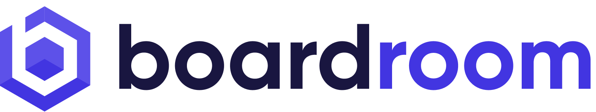

# Welcome

Boardroom is a protocol-agnostic governance platform. The platform is home to hundreds of **DAOs**, helping their members frictionlessly participate in their governance.

## Add Your DAO to Boardroom

To see if your project is already integrated, check out our [Supported Protocols](protocols.md) page.


[2.-submit-your-metadata.md](adding-your-project/2.-submit-your-metadata.md)


## Integrate Governance Data In Your Application

Boardroom provides [The Boardroom API](boardroom-api/boardroom-api.md) as an open, public resource for anybody looking to use our aggregated governance data (provided by the [Governance SDK](sdk/governance-sdk.md)) in their client or server applications. Use our HTTP API to fetch governance data for specific protocols or aggregated across multiple protocols that we support.


[boardroom-api.md](boardroom-api/boardroom-api.md)


### Directly Integrate with the Governance SDK

The [Boardroom API](boardroom-api/boardroom-api.md) provides the fastest and simplest way to begin integrating governance data in your applications. However, if you are looking to allow client-side governance interactions such as submitting on-chain proposals or votes or signaling on off-chain platforms like Snapshot, you can directly use the [Governance SDK](sdk/governance-sdk.md) in your browser-based dApp.


[quick-start.md](sdk/quick-start.md)

