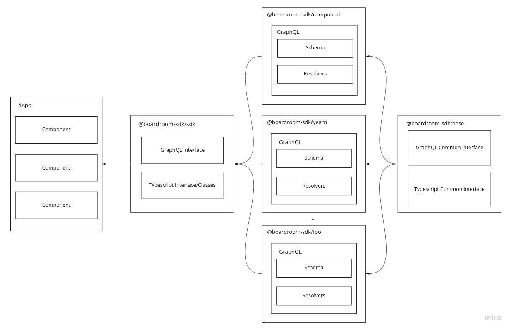

# Home

The Boardroom SDK is a collection of governance protocols. All read & write operations can be invoked through a GraphQL or Typescript interface. Each protocol extends from a common interface, allowing app developers to easily consume all governance protocols in aggregate.

