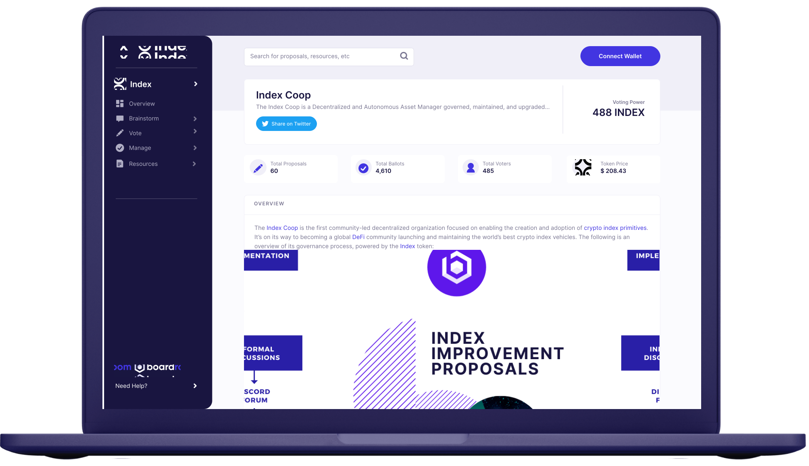

# Home

## What is Boardroom?

Boardroom is a protocol-agnostic governance and management platform built to improve distributed decisionmaking across crypto networks. We believe these networks will uproot traditional management and ownership structures. They have already demonstrated a powerful new economic model for building software applications, wherein users build and operate products and services they use every day. In exchange for their contributions, many of these platforms reward users with a direct ownership stake which aligns their success with that of the platform.  
  
With this ownership comes a responsibility to steward governance, communication, and engagement to ensure a powerful alignment between diverse owners.












