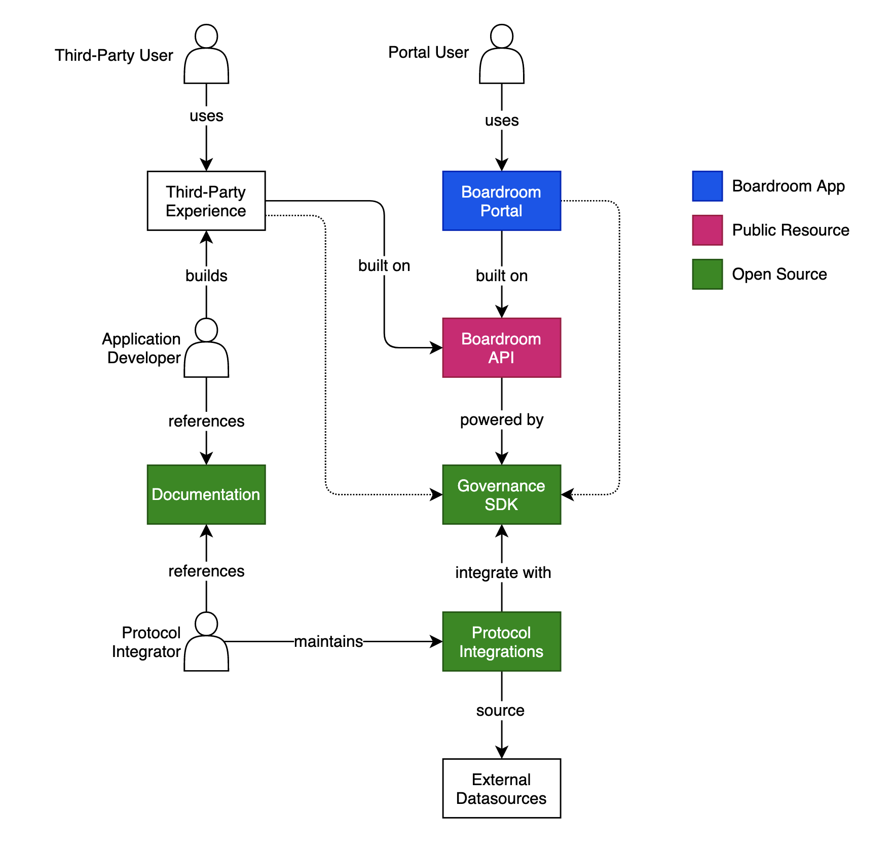

# Boardroom Overview

## System Architecture

#### Boardroom Portal

Our governance aggregation portal. Powered by the Boardroom API \(for aggregated read-only data\) and the Governance SDK \(for client-side interactions transactions\). Portal Users are protocol stakeholders that want to engage in protocol governance across any of our supported protocols.


Checkout the Boardroom Portal [here](https://app.boardroom.info).


#### Third-party Experience

External applications or experiences built on top of the Boardroom API. These can be apps, platforms, or dApps that want to integrate information or aggregated data about protocol governance for their end users.

Third-party applications can also use the Governance SDK to query data and submit transactions via a normalized programatic interface that directly access external datasources.

#### Boardroom API

A free and publically accessible REST API that surfaces information and aggregated governance data for all protocols integrated with the Governance SDK.

#### Governance SDK

An open-source governance interopability framework. Powers the Boardroom API which uses it to query governance data, and can be used by clients to directly access governance data from downstream datasources.

#### Protocol Integrations

Open-source and community-mainted integrations that add support for a protocol to the Governance SDK. Protocol integrations enable querying of governance data and client-side integrations with a protocol's governance framework.



#### External Datasources

Protocol integrations communicate with external datasources such as blockchain networks, traditional web services, TheGraph, IPFS, etc.

#### Documentation

You are here! Our documentation is open-source.

## The Role of The Governance SDK

The Governance SDK is fully open-source and relies on community contributions to support the growing number of protocols in the ecosystem. It's role is to provide abstractions for core governance concepts like proposals, voting, and finance so that client experiences can interact with protocols in a normalized way. 

Because of the large volume of data, and some of the challenges involved with directly communicating with the downstream datasources, we built the Boardroom API that aggregate and index data in a way that can benefit anybody looking to explore or build experiences on governance data.

Decentralization is important to us at Boardroom, and we're always looking for ways to make our system more open and resilent as decentralized tech offerings mature in the space. 

