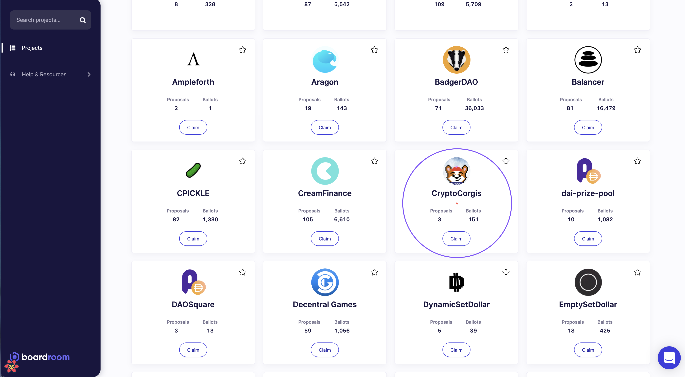

# 3. Claim Your Space

The final step to get your project integrated into Boardroom is to claim your space.

As anyone can create a space on snapshot, we have added a claiming step as a liveness check to make sure we do not have any zombie projects in the portal. 

The process to claim your space is simple.

**Step 1:** Find your space in the Boardroom Hub front page. For example: 

**Step 2:** Click the claim button

**Step 3a:** If you are a member of the snapshot space, you will be prompted to fill out some basic information, as well as a more detailed overview of your team's governance process. 

**Step 3b.** If you are not a member, you will be prompted to reach out to a snapshot space member to come claim the space.

**Step 4.** After you have filled out the details, and signed the message, your claim will be vetted and, if approved, your space will be unlocked within 24-36 hours.

**N.B.** As a preliminary check for liveness, only snapshot spaces with at least 3 members are made available to claim on Boardroom. 


If your space does not show up on the UI, please reach out to the Boardroom Team on Discord and include your Protocol Information pull request


