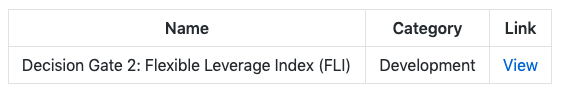

# Adding Content

Content files will be sorted by date. Add the date \(dd-mm-yy\) to the file name you are creating. This date will be hidden on the Boardroom portal but will sort the files by most recent.

### New Content Folders

New content folders will dynamically display a new item under the 'Resources' tab. 

Raise a new pull request by following the steps below:

1\) Create a new folder inside protocol folder. _The Folder name will be the sub nav item displayed under resources in sidebar._

2\) Add content inside the folder by adding new files.

3\) Raise a pull request with the changes.

### New Files

1\) Create a new file in the Dynamic folder of the protocol. _The Filename will be the title displayed in the 'Folder' tab list._

2\) Add Content in the markdown file. The contents of the file will be displayed in the respective page.

3\) Raise a pull request with the changes.

### New Calendar Events

1\) Add one or more new events to the `events.json` file of the protocol using the following format:

* **title**: The title of the event - this will be shown in the month and day view.
* **url**: A URL to link to when an event is clicked.
* **date**: The UTC date of the event in ISO 8601 format

```text
[
  {
    "title": "This is an example event.",
    "url": "https://example.com",
    "date": "2021-01-08T00:00:00.000Z"
  },
  {
    "title": "This is another example event.",
    "url": "https://example.com",
    "date": "2021-01-10T00:00:00.000Z"
  }
]
```

1. Raise a PR with the changes.

### New Weekly Updates

1\) Create a new file in an new 'Updates' folder. _The Filename will be the title displayed in the 'Folder' tab list._ Remember to add the date to the filename \(Update Title + dd-mm-yy\)

2\) Add Content in the markdown file. The contents of the file will be displayed in the respective page.

3\) Weekly updates should be categorized by "Live Votes", "Recent Votes", and "Discussions".

4\) For each Proposal or Discussion, add a Markdown Table with the Title, Category, and Link:



Choose from the following categories: 

* Parameter Change
* Staffing
* Treasury
* Marketing
* Strategy
* Product
* Development
* Meta-Governance \(if applicable\)
* Other

4\) Add a short \(100 words max\) description under the table.

5\) Repeat the steps for every proposal or discussion relevant to that week.

6\) Raise a pull request with the changes.

