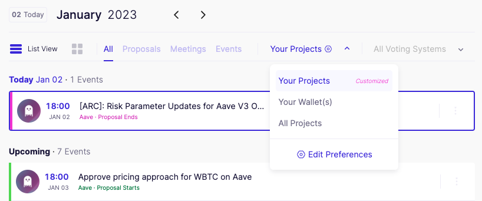

# Boost Your Experience

[Boardroom Boost](https://boardroom.io/portal/settings/feed) is an enhanced experience of the governance dashboard built for highly engaged voters and delegates. A boosted account allows a connected wallet to completely customize their governance experience by allowing a user to track specific projects accross the application.

| ||
|    :----:   |    :----:   |

Under the Boosted experience, a user can filter their [feed](https://boardroom.io/portal) to only display proposals for your selected projects.

These selections can be also reflected in Email Alerts that allow users to track new and ending proposals accross all supported projects.

