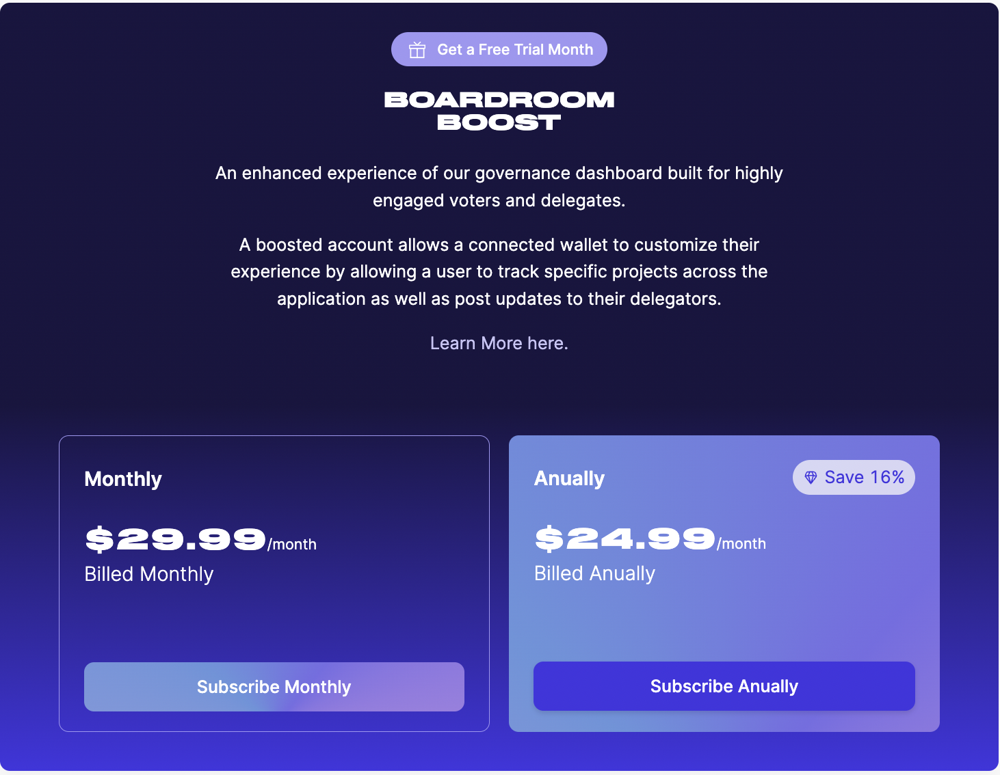

# Boost Your Experience

[Boardroom Boost](https://boardroom.io/feed/settings/feed) is an enhanced experience of the governance dashboard built for highly engaged voters and delegates. A boosted account allows a connected wallet to completely customize their governance experience by allowing a user to track specific projects accross the application as well as post updates to their delegators.

| ||
|    :----:   |    :----:   |

#### Customize Your Projects

Under the Boosted experience, a user can filter their [feed](https://boardroom.io/feed) to only display proposals for your selected projects.

|||
|    :----:   |    :----:   |

#### Post Messages For Your Delegators 

Delegates and voters can also post messages for their delegators on Boardroom's new delegation tab:

|||
|    :----:   |    :----:   |

#### Sign Up For Custom Notifications

These selections can be also reflected in [Email Alerts](https://boardroom.io/feed/settings/notifications) that allow users to track new and ending proposals accross all supported projects.

This functionality gives delegates the power to customize their entire voting experiance as well as a direct line of communication to their delegators, an experience easily accessible from a single governance portal. 

| |<a href="https://boardroom.io/portal/settings/feed"><button style="all:unset;font-family:Helvetica,Arial,sans-serif;display:inline-block;max-width:100%;white-space:nowrap;overflow:hidden;text-overflow:ellipsis;background-color:#0445AF;color:#FFFFFF;font-size:16px;border-radius:25px;padding:0 33px;font-weight:bold;height:50px;cursor:pointer;line-height:50px;text-align:center;margin:0;text-decoration:none;">Sign Up Now ➤</button><a/> | |
|   :----:   |    :----:   |    :----:   |  