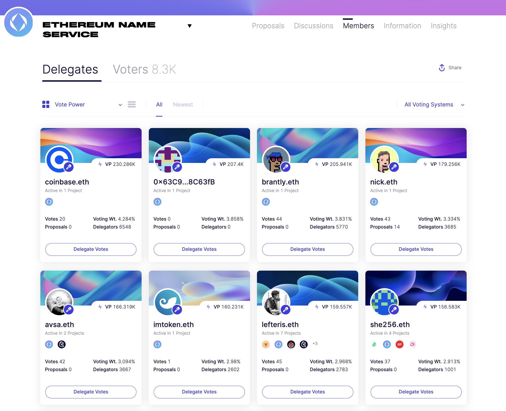
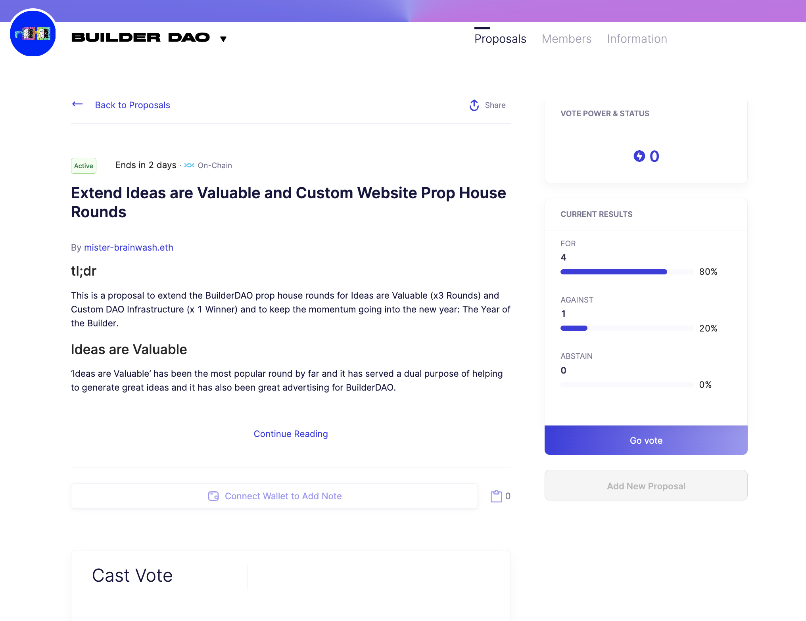
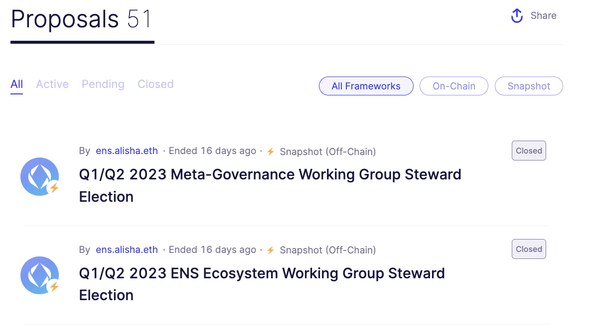
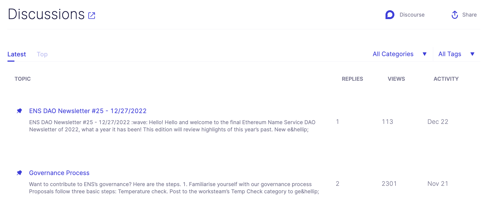
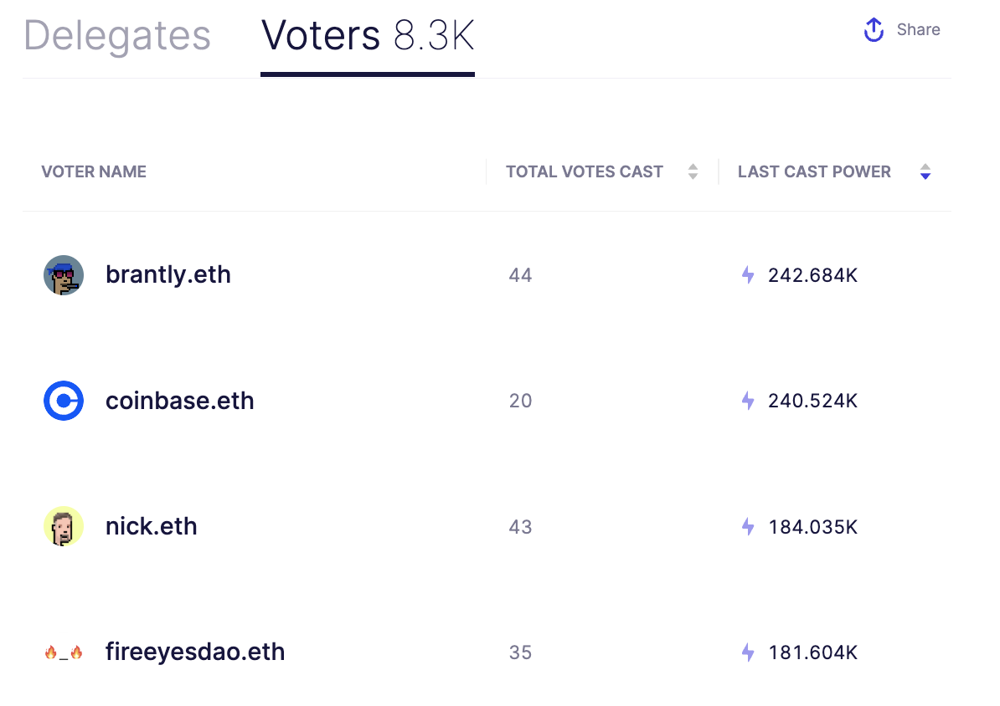
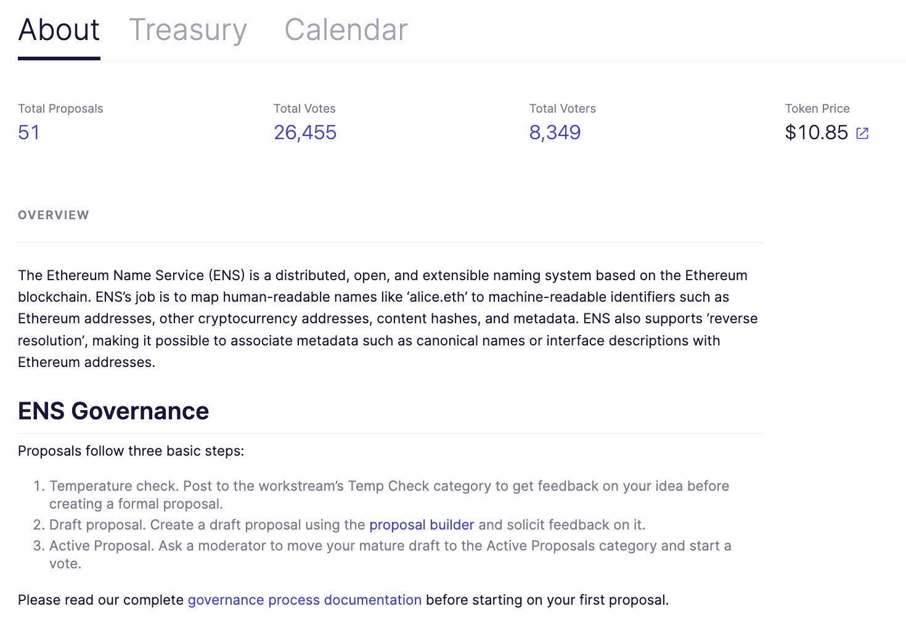

# About Us
<!-- theme: info -->
> ### The all-in-one governance interface built for token holders.

|  ||
|    :----:   |    :----:   |

| |<a href="https://boardroom.io/ens"><button style="all:unset;font-family:Helvetica,Arial,sans-serif;display:inline-block;max-width:100%;white-space:nowrap;overflow:hidden;text-overflow:ellipsis;background-color:#0445AF;color:#FFFFFF;font-size:16px;border-radius:25px;padding:0 33px;font-weight:bold;height:50px;cursor:pointer;line-height:50px;text-align:center;margin:0;text-decoration:none;">Explore a Project ➤</button><a/> | |
|   :----:   |    :----:   |    :----:   |  

The success and sustainability of your project relies on the participation and decision-making of your community. By providing your voters with access to a comprehensive and user-friendly governance dashboard, you can help to increase transparency and participation in the decision-making of your project. 

Our [Governance API](https://docs.boardroom.io/docs/api) also makes this data free and accessible for any stakeholder or developer. This interface can ensure that your community is well-informed and actively engaged in the decision-making processes of your organization:

> Boardroom currently supports over 250 projects and can support projects built on any governance system. Check if your project is [already listed](../2-protocols.md), or submit a [request for listing](../2-protocols.md). 

## Features
Providing your community with access to a comprehensive governance dashboard can  help build trust and credibility for your DAO. By demonstrating that you value the input and contributions of your members, you can encourage greater adoption and success for your project. Investing in a governance dashboard is an important step towards building a strong and engaged community that is essential to the long-term success of your DAO.

*An integration with Boardroom will enabling the following functionality and much more:*

|[**Project Proposals**](Features/proposals.md)|[**Forum Discussions**](Features/discussions.md)|[**Members and Voters**](Features/members.md)|[**Project Information**](Features/information.md)|
|   :----:         |    :----:   |   :----:   |   :----:    |
|  Browse, track, vote, and leave notes on onchain and offchain proposals. |  View and link out to relevant forum discussions pulled in from Discourse.  |  Explore thousands of delegate and voter profiles to delegate vote power with context.  | Stay up to date on core governance metrics, proposals start and end dates, and treasury information. |

## Partner with Boardroom
Ouer **Facilitators Program** partners Boardroom with DAOs and Foundations to subsidize Boardroom Boost subscriptions for their top delegates and voters while creating recurring weekly governance content for all token holders.

<a href="(2-Partnerships.md)"><button style="all:unset;font-family:Helvetica,Arial,sans-serif;display:inline-block;max-width:100%;white-space:nowrap;overflow:hidden;text-overflow:ellipsis;background-color:#0445AF;color:#FFFFFF;font-size:20px;border-radius:25px;padding:0 33px;font-weight:bold;height:50px;cursor:pointer;line-height:50px;text-align:center;margin:0;text-decoration:none;">Explore ➤</button><a/>