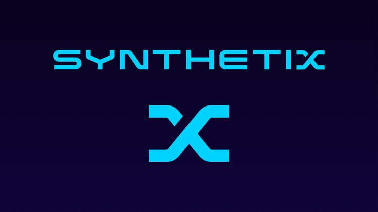
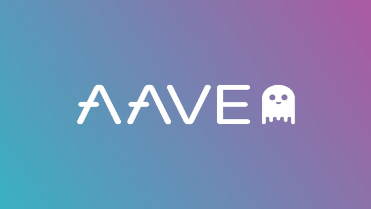
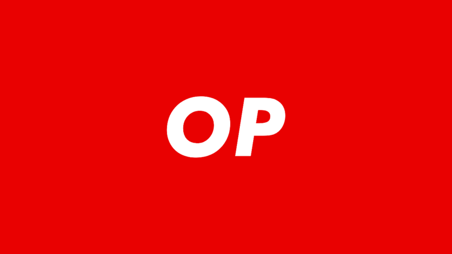
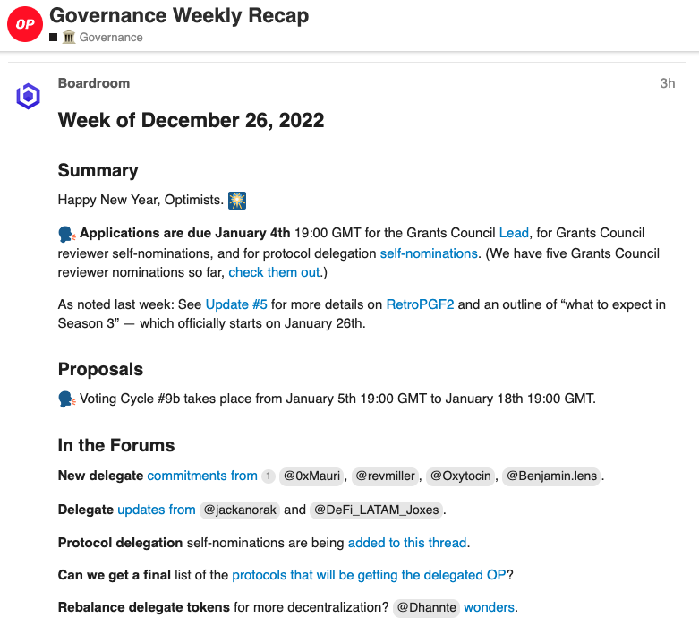

# Partner with Boardroom

*The [Boardroom Facilitators](url) program partners Boardroom with DAOs and Foundations to ensure their token holders have the access to best in class governance tooling to engage and participate in the governance and decision-making of the project.*

The partnership provides **free subscriptions for top delegates, governance activity coverage, and feature request priority for DAOs.**

| |Featured Partners |    |   
|   :----:   |    :----:   |    :----:   |  
||||
| Explore the [Synthetix Governance interface](https://governance.synthetix.io/councils) profiles powered by the Boardroom Governance API | Explore Aave [Weekly Governance Updates](https://boardroom.io/aave/resources/Weekly%20Recaps) published in collaboration with Aave Grants | Explore the [Delegate Discovery](https://boardroom.io/optimism/delegates) site launched in conjuntion with a delegation incentive campaign|

| |<a href="https://calendly.com/d/d5z-6wd-6vs/facilitators-program-onboarding"><button style="all:unset;font-family:Helvetica,Arial,sans-serif;display:inline-block;max-width:100%;white-space:nowrap;overflow:hidden;text-overflow:ellipsis;background-color:#0445AF;color:#FFFFFF;font-size:16px;border-radius:25px;padding:0 33px;font-weight:bold;height:50px;cursor:pointer;line-height:50px;text-align:center;margin:0;text-decoration:none;">Get a Quote ➤</button><a/> | |
|   :----:   |    :----:   |    :----:   |  

## How does the program help your community?

### Boost Subscriptions

||The Boardroom Facilitators program allows DAOs and Foundations to subsidize the cost of Boardroom Boost for a minumum of 50 delegates at a **15% discounted rate**. The DAO project will receive one year, 100% discount codes to distribute to their top delegates. This program renews every year at which point new codes will be issued for all users. |
|    :----:   |    :----  |  

> Learn more about the benefits of [**Boardroom Boost**](../Boardroom-Boost/About-Boost.md) subscription for voters and delegates.

### Weekly Coverage

| | Our analyst provide succint weekly recaps of all governance activity, posted on a weekly basis on the Boardroom interface and governance forums. This content is available for any entity to distribute to token holders how they see fit. Additonally, all project proposals will include an auto generated summary description on the Boardroom Feed.  |
|    :----:   |    :----  |  

#### **Why is coverage valuable?**

- **Neutrality** - Neutrality is essential to be a credible steward of governance. Ultimately Boardroom has this mandate because it is trusted by governance participants across multiple protocols to create governance tooling without bias toward outcomes.
- **Consistent Support** - The governance processes of communities struggle to operate consistently and clearly without continuous coordination. Boardroom fulfills the role of officials in traditional systems of governance, leaving those involved in governance able to spend more time on decision-making and discussion.
- **Offload Delegate Responsibilities** - informed delegates spend 20+ hours a week engaging in governance forums, lobbying activities, and extensive off-forum work discussing with proposer teams, DAO members, and other delegates.
- **Content and Communication** - Content creation and communications are key pieces of governance maintenance. It isn't easy to facilitate effective governance if high-quality communication platforms and norms do not exist.

| |<a href="https://calendly.com/d/d5z-6wd-6vs/facilitators-program-onboarding"><button style="all:unset;font-family:Helvetica,Arial,sans-serif;display:inline-block;max-width:100%;white-space:nowrap;overflow:hidden;text-overflow:ellipsis;background-color:#0445AF;color:#FFFFFF;font-size:16px;border-radius:25px;padding:0 33px;font-weight:bold;height:50px;cursor:pointer;line-height:50px;text-align:center;margin:0;text-decoration:none;">Get a Quote ➤</button><a/> | |
|   :----:   |    :----:   |    :----:   |  
