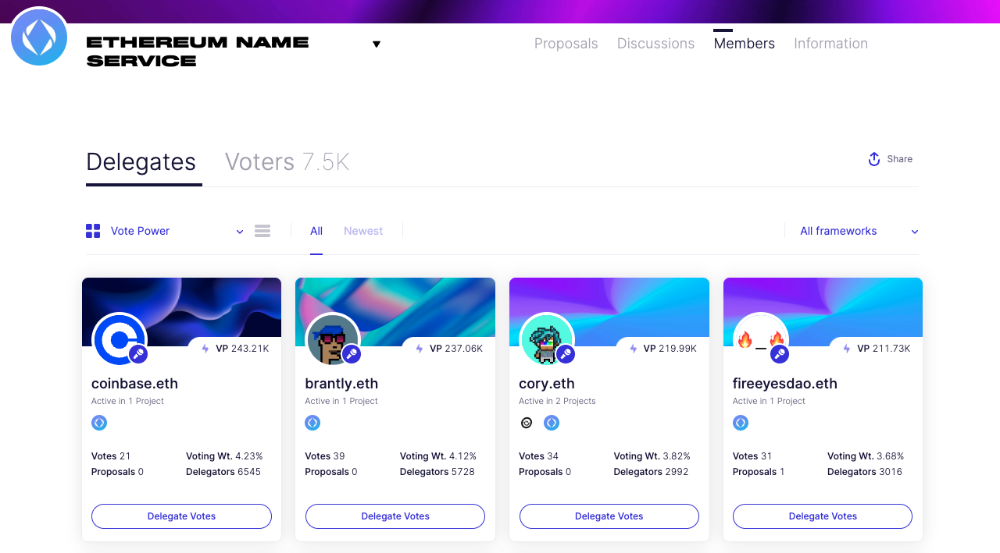

# Members

> The members page surfaces a DAO's delegate and voters list. [Browse an example.](https://boardroom.io/compound/delegates)

## 👥 Delegates

The Delegates tab enables stakeholders to browse profiles of delegates and delegate their vote power. After finding a suitable delegate, tokenholders can delegate their vote from within the page by selecting the "Delegate Votes" button on a given delegates profile.

Delegate profiles contain:

1. History of their votes
2. Number of delegators
3. Voting weight
4. Proposal history

After connecting their wallet, delegates can also share additional information about themselves and their voting behavior within their profile.

***

## ✅ Voters

The Voters tab outlines a list of voters sorted by their vote power. The voter list can be sorted by total votes cast and last cast power.

