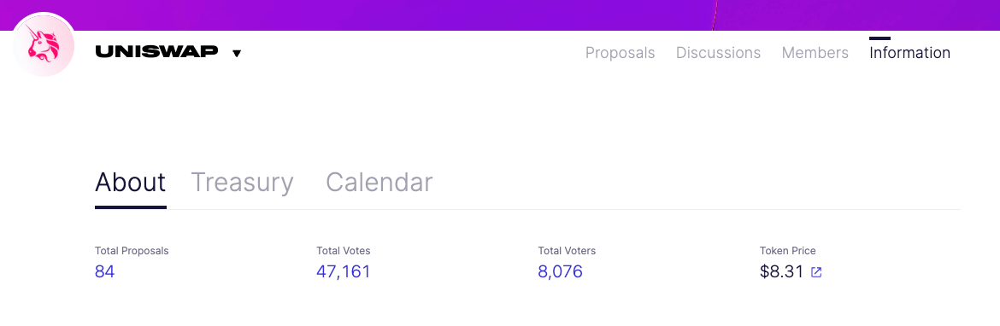
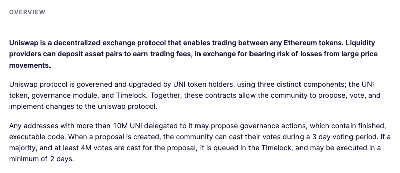
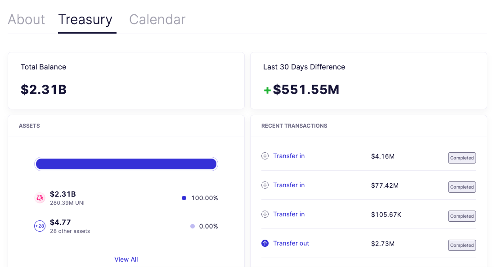
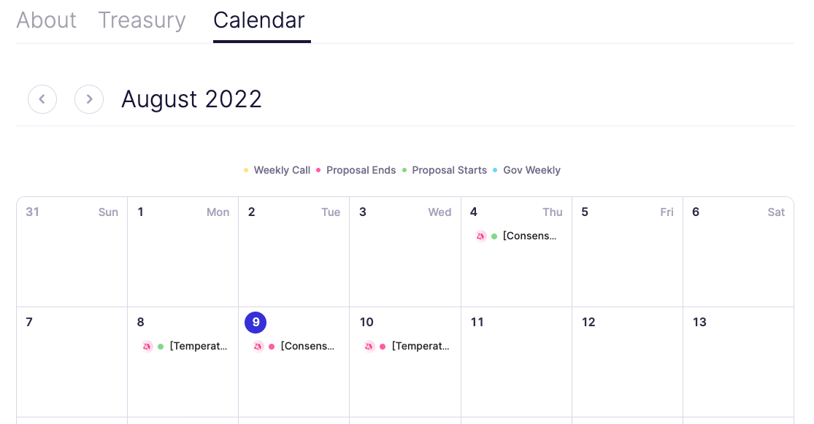

# Information Page

> The information page outlines a project's key stats, description, and governance process.

At the top of the page in the "**About**" tab, key governance information is highlighted.

The "**Overview**" section gives DAOs a space to describe their mission, governance model, links, and a variety of other resources.

The "**Treasury**" tab summarizes a DAO's treasury balance, assets, and recent transactions.

The "**Calendar**" tab shows a calendar view of proposal start and end dates.

