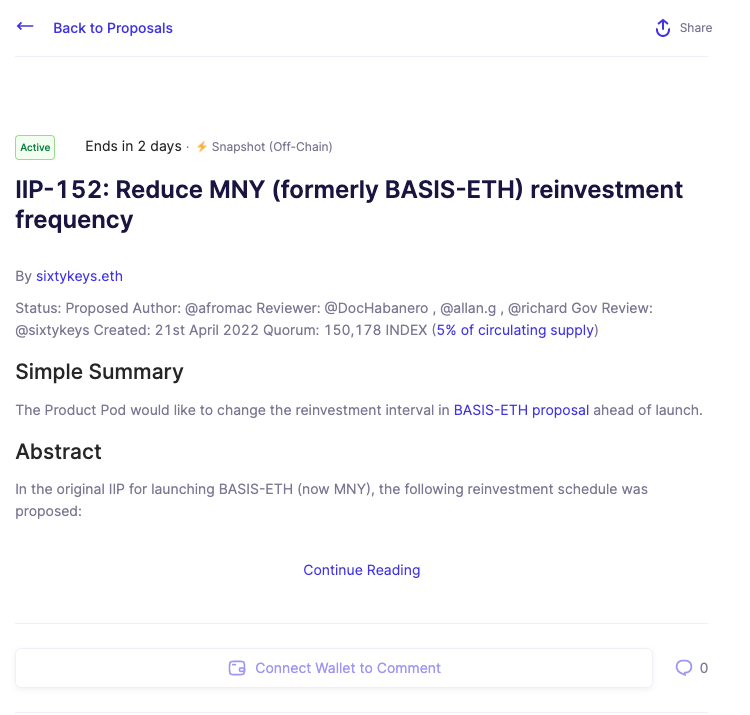
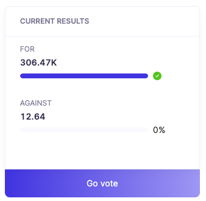
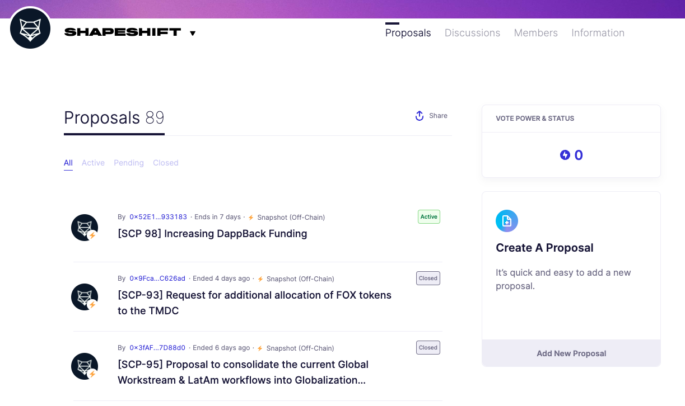
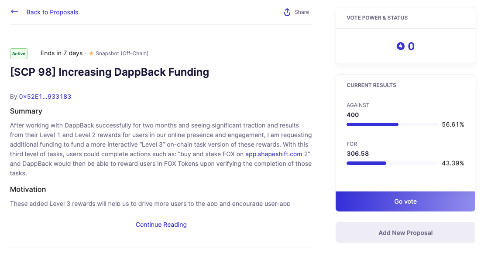

# Proposals Page

> This page highlights a list of the most recent proposals associated with a DAO. If a DAO has multiple governance frameworks, proposals are filterable.

Each Proposal page contains a description of the given proposal, generally containing a short summary of the proposed changes, goals and motivations for the proposed actions, and an implementation specification. 

The current results module shows the current vote tally for or against for active proposals, or the outcome for closed and executed proposal.

***

## Vote on a Proposal

1. From the "Projects" page, select a DAO you are interested in to view the project's "Proposals" page

2. Select an active proposal you wish to vote in

3. Select the "Go Vote" button or scroll to the "Cast Vote" section to view the voting options

4. Select a vote option and click "Cast Vote" to cast your vote
