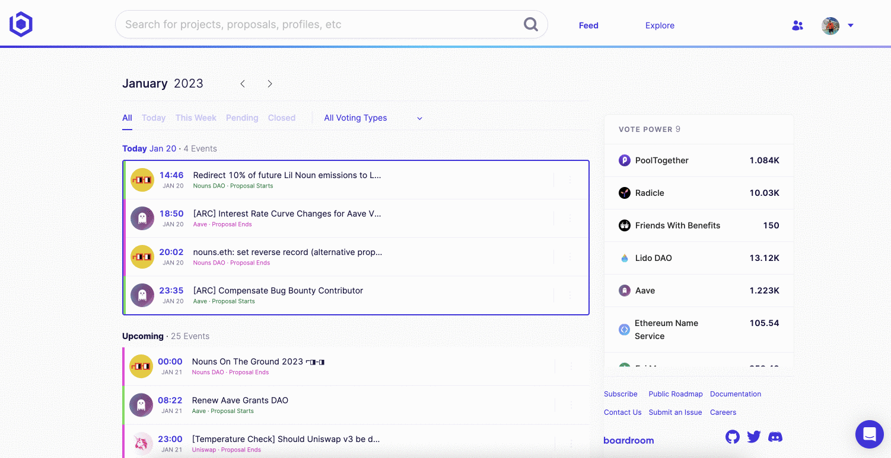
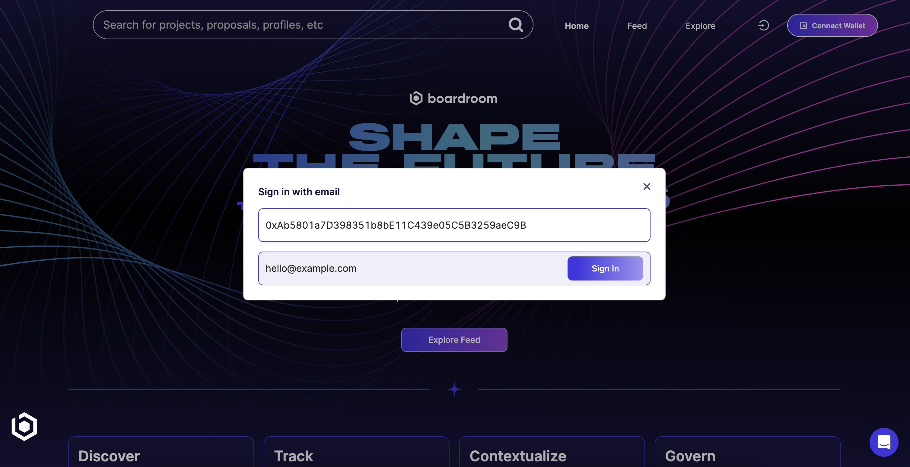
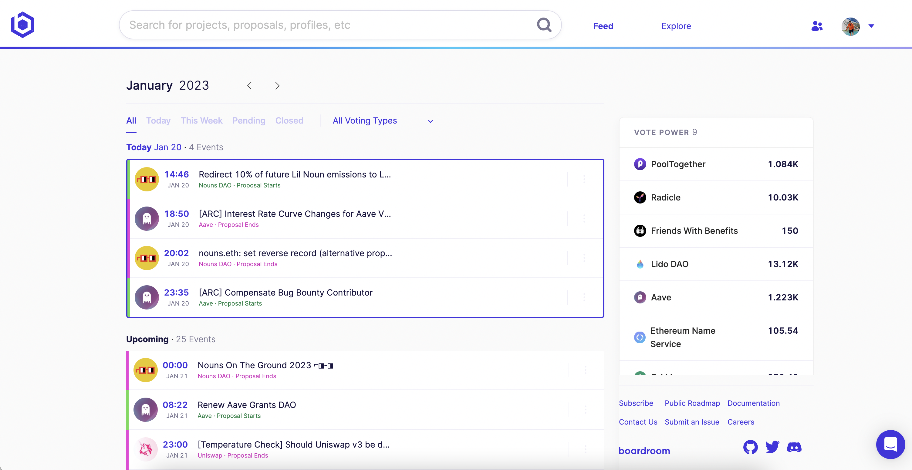
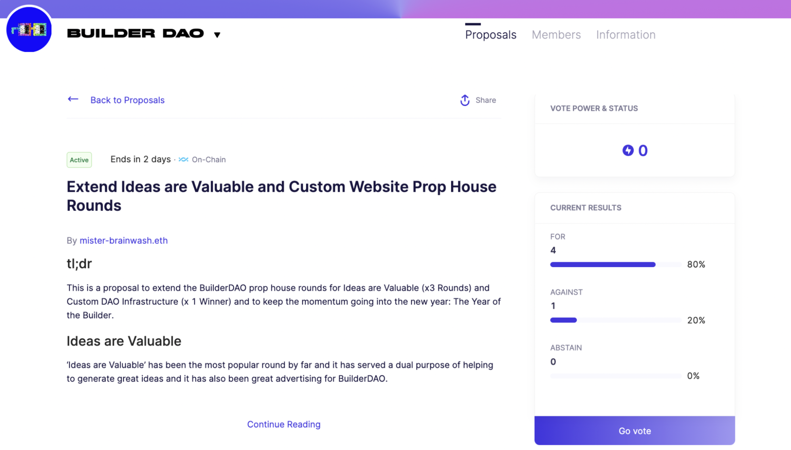
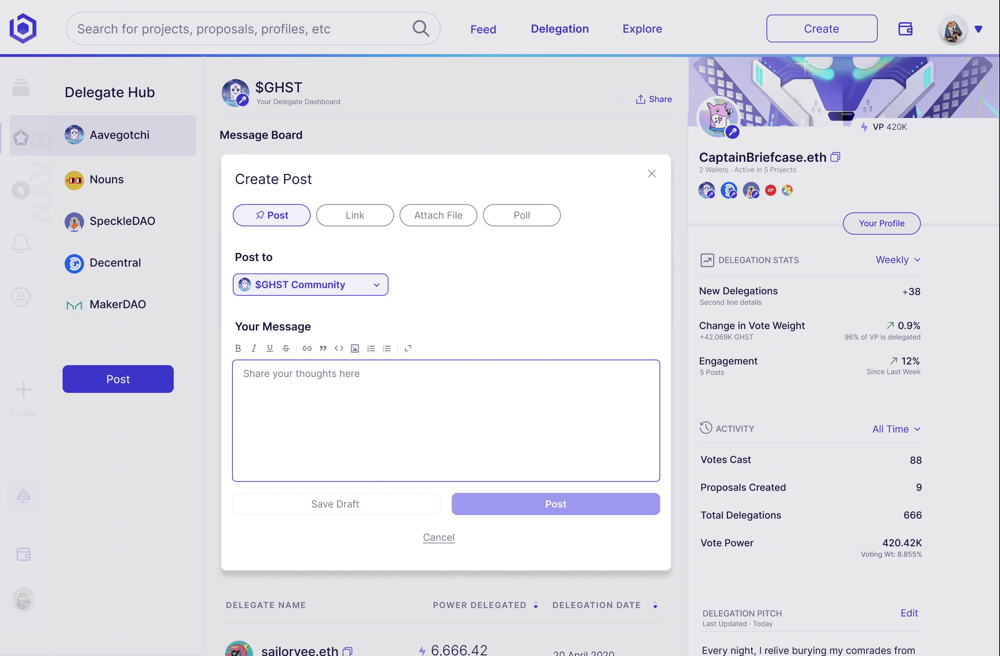
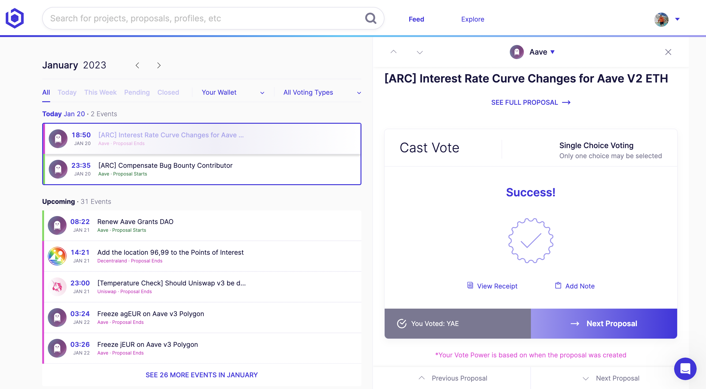

# Teams Overview
<!-- theme: info -->
> ### The web3 dashboard built for active network participants.

Our dashboard helps organizations have a greater impact with governance management software built to streamline tracking, voting, communications, and reporting workflows.

If you're looking to simplify your governance process and elevate your impact in the ownership economy, the 'Teams' dashboard uses an intuitive interface and robust feature set to help your team manage your governance tasks with ease.

| |<a href="https://calendly.com/kevinnielsen/boardroom-teams-overview"><button style="all:unset;font-family:Helvetica,Arial,sans-serif;display:inline-block;max-width:100%;white-space:nowrap;overflow:hidden;text-overflow:ellipsis;background-color:#0445AF;color:#FFFFFF;font-size:16px;border-radius:25px;padding:0 33px;font-weight:bold;height:50px;cursor:pointer;line-height:50px;text-align:center;margin:0;text-decoration:none;">Schedule a Demo ➤</button><a/> | |
|   :----:   |    :----:   |    :----:   |  

## Team Members
> **Boardroom Teams enables a global shared view for all team members, regardless of how they signed in.**

Add an unlimited number of team members to your organization that can view and access our shared team governance feed. All they need is an email address.

Team members can:

- Sign in using an **email**.
- Leave internal **notes** on proposals.
- View a shared **feed** and profile of your main wallets.
- Download bundled vote **history** for your main wallets.
- Post **updates** to your delegators on behalf of your team. 

## Workflows
|[**MONITOR**](2-Voting.md)|[**ANALYZE**](4-Profile.md)| [**ENGAGE**](3-Delegation.md)|[**EXECUTE**](2-Voting.md)|
|   :----:         |    :----:   |   :----:   |   :----:    |
| Stay on top of governance proposals and never miss a decision with our configurable dashboard and alerting system based on your portfolio. | Analyze and understand your influence, inform your team with internal notes, and export multiple wallet activity to share with your stakeholders. | Explore and browse all your delegators and their profiles, and post updates only they can see.  | Cast votes across any supported protocol, even if your wallet isn't connected with our new proxy service. |

## Onboard Your Team
Set up a 30 minute demo with us to see the product in action and learn how it can benefit your team. We'll onboard your team in no time.

<a href="https://calendly.com/kevinnielsen/boardroom-teams-overview"><button style="all:unset;font-family:Helvetica,Arial,sans-serif;display:inline-block;max-width:100%;white-space:nowrap;overflow:hidden;text-overflow:ellipsis;background-color:#0445AF;color:#FFFFFF;font-size:20px;border-radius:25px;padding:0 33px;font-weight:bold;height:50px;cursor:pointer;line-height:50px;text-align:center;margin:0;text-decoration:none;">Schedule a Demo ➤</button><a/>