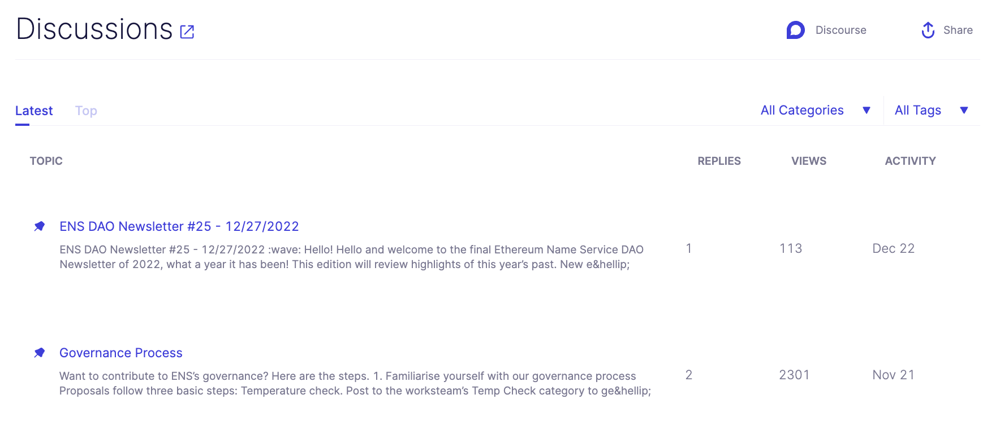

# Boardroom Teams
<!-- theme: info -->
> ### The web3 dashboard built for active network participants.

Our dashboard helps organizations have a greater impact with governance management software built to streamline tracking, voting, communications, and reporting workflows.

|  ||
|    :----:   |    :----:   |

| |<a href="https://calendly.com/kevinnielsen/boardroom-teams-overview"><button style="all:unset;font-family:Helvetica,Arial,sans-serif;display:inline-block;max-width:100%;white-space:nowrap;overflow:hidden;text-overflow:ellipsis;background-color:#0445AF;color:#FFFFFF;font-size:16px;border-radius:25px;padding:0 33px;font-weight:bold;height:50px;cursor:pointer;line-height:50px;text-align:center;margin:0;text-decoration:none;">Schedule a Demo ➤</button><a/> | |
|   :----:   |    :----:   |    :----:   |  

## Team Members
iikhkjhjh

## Workflows

|[**MONITOR**](Features/1-proposals.md)|[**ANALYZE**](Features/2-discussions.md)|[**ENGAGE**](FFeatures/3-members.md)|[**EXECUTE**](Features/4-information.md)|
|   :----:         |    :----:   |   :----:   |   :----:    |
| Stay on top of governance proposals and never miss a decision with our configurable dashboard and alerting system – all built on top of institutional-grade API. Proposals based on your portfolio and ownership. | Analyze and understand your ownership Inform your team with internal notes,Bundle your multiple wallet activity and share with your stakeholders |  Explore thousands of delegate and voter profiles to delegate vote power with context.  | Stay up to date on core governance metrics, proposals start and end dates, and treasury information. |

## Onboard Your Team
Ouer **Facilitators Program** partners Boardroom with DAOs and Foundations to subsidize Boardroom Boost subscriptions for their top delegates and voters while creating recurring weekly governance content for all token holders.

<a href="https://docs.boardroom.io/docs/documentation/d38s5vzb9qion-partner-with-boardroom"><button style="all:unset;font-family:Helvetica,Arial,sans-serif;display:inline-block;max-width:100%;white-space:nowrap;overflow:hidden;text-overflow:ellipsis;background-color:#0445AF;color:#FFFFFF;font-size:20px;border-radius:25px;padding:0 33px;font-weight:bold;height:50px;cursor:pointer;line-height:50px;text-align:center;margin:0;text-decoration:none;">Schedule a Demo ➤</button><a/>