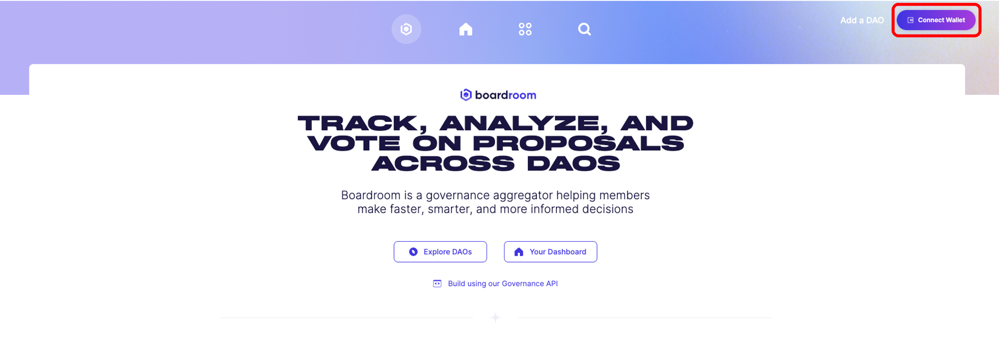
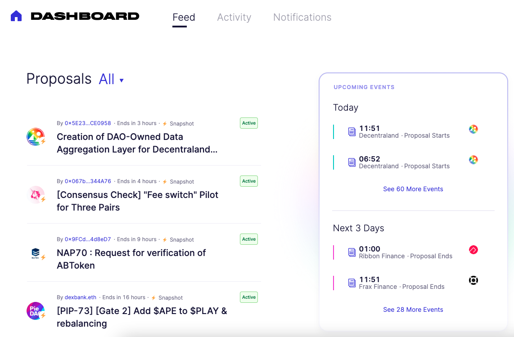
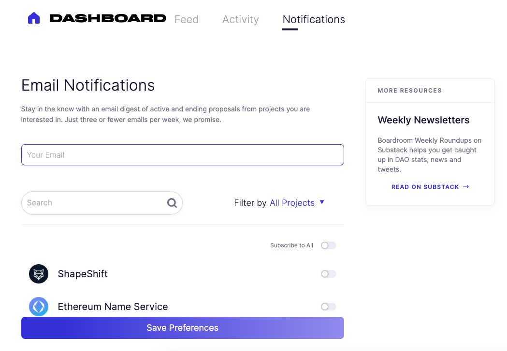

# Voting

The Dashboard page shows proposal information for all DAOs integrated on the Boardroom platform.

***

The Dashboard page surfaces:

1. Summary of proposals of governance tokens in your wallet
2. Recent governance activity (e.g. votes and proposals) associated with your wallet
3. Notification preferences

***

## Alerting

Select the "Preferences" page to subscribe to an email digest with proposals from projects you are interested in.

Connect your wallet by selecting the "Connect Wallet" button from the top right corner of any page of Boardroom.

| |  |
|    :----:   |  :----:  |  

***

## Voting

Select the "Dashboard" button to view the "Feed" page - a list of proposals from DAOs on the Boardroom platform.

||  |
|    :----:   |  :----:  |  

1. **Filter** proposals by Active/Closed/Pending using the dropdown selector
2. **Toggle** the "Your DAOs" selector to view proposals associated with tokens held by the connected wallet

***

## Proxy Voting

Select the "Activity" page to view a your vote history and proposal history

# Your Dashboard

The Dashboard page shows proposal information for all DAOs integrated on the Boardroom platform.

***

The Dashboard page surfaces:

1. Summary of proposals of governance tokens in your wallet
2. Recent governance activity (e.g. votes and proposals) associated with your wallet
3. Notification preferences

***

## Connect Wallet

Connect your wallet by selecting the "Connect Wallet" button from the top right corner of any page of Boardroom.

| |  |
|    :----:   |  :----:  |  

***

## View Proposals

Select the "Dashboard" button to view the "Feed" page - a list of proposals from DAOs on the Boardroom platform.

||  |
|    :----:   |  :----:  |  

1. **Filter** proposals by Active/Closed/Pending using the dropdown selector
2. **Toggle** the "Your DAOs" selector to view proposals associated with tokens held by the connected wallet

***

## View Vote and Proposal History

Select the "Activity" page to view a your vote history and proposal history

***

## Edit Email Notifications

Select the "Preferences" page to subscribe to an email digest with proposals from projects you are interested in.

||  |
|    :----:   |  :----:  |  

1. Enter your email in the "Your Email" field
2. Select the DAOs you are interested in receiving proposal updates
3. Select "Save Preferences"

