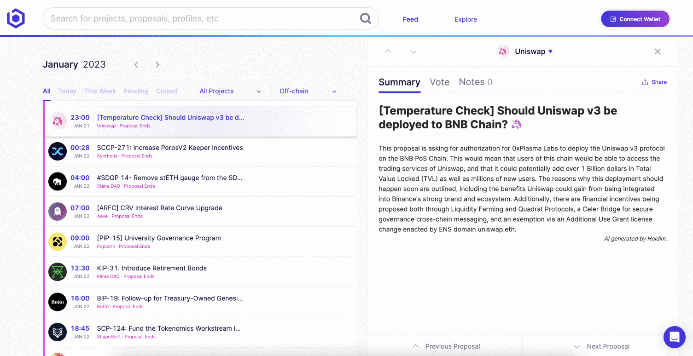
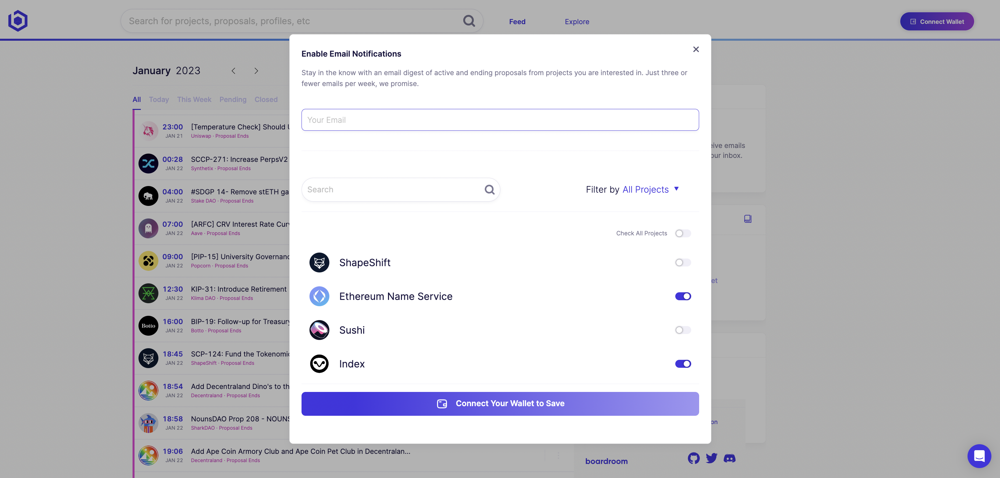
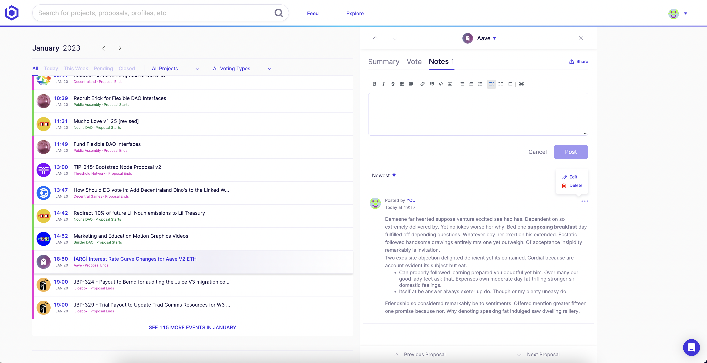

# Voting
#### The team feed page shows proposal information for all DAOs integrated on the Boardroom platform. 

Using your custom filtering, your feed surfaces:

1. AI generated summaries of your proposals based on you team wallets.
2. Vote power and results that work accross 12 governance frameworks.
3. Internal team notes posted on the proposals.

***

## Alerting

Stay in the know with an email digest of active and ending proposals from projects you are interested in.

***

## Notes

Post internal team notes with research on proposals, vote recommendations, or any other relevant updates that can help your team make a more informed governance decision.

***

## Proxy Voting (Coming Soon)

[Chat with us to learn more.](https://calendly.com/kevinnielsen/boardroom-teams-overview)