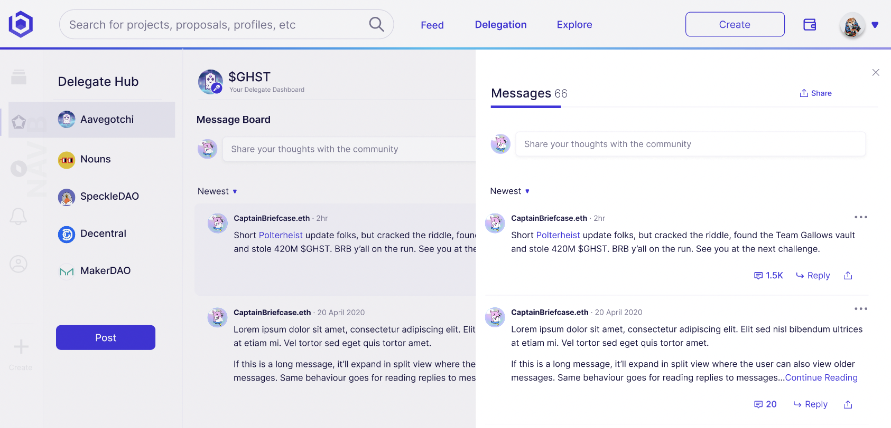
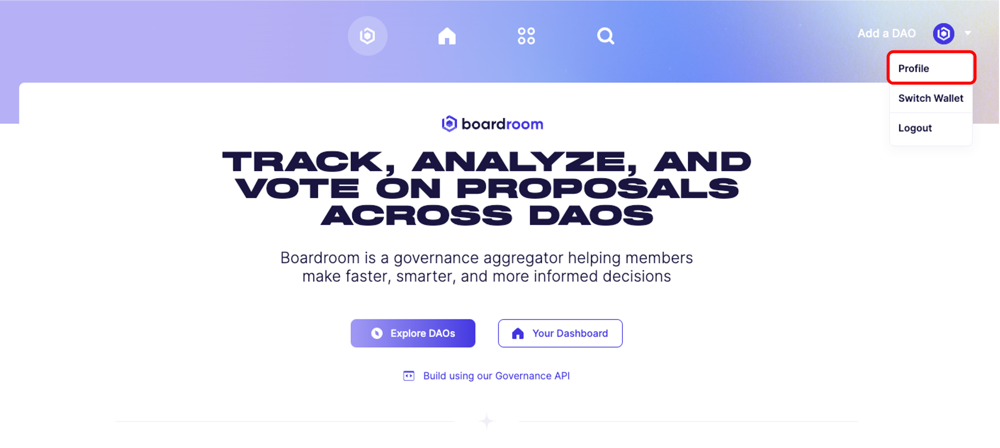
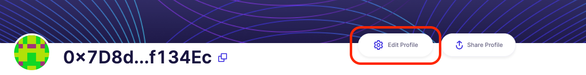

# Profile

The Profile page highlights your organization's **bundled** vote and proposal history, accross an unlimited number of governance wallets. 

***

## Messaging

Post updates to your delegators accross all of your governance wallets and ecosystems. Only wallets that are currently delegating to any of your addresses are able to view the updates. Anyone can delegate voting on this page - this is a great landing to encourage delegations to your organization! 

It also allows users to share information about themselves and links to their social media and projects.

## View Your Profile and Vote Power

View your profile by selecting the "Profile" option from the dropdown on the top right corner of any page on Boardroom.

| |  |
|    :----:   |  :----:  |  

Select "Edit Profile" to modify your public profile:

| |  |
|    :----:   |  :----:  |  

From the edit page you can modify:

1. **Display Name** - Name associated with your wallet and profile
2. **ENS** - Your ETH address
3. **About** - Share a little about yourself and your history, activities, and contributions to the communities you are a part of
4. **Twitter** - Share your Twitter handle
5. **Website** - Share a link to your personal site or project

