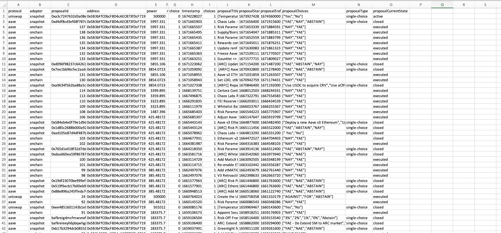
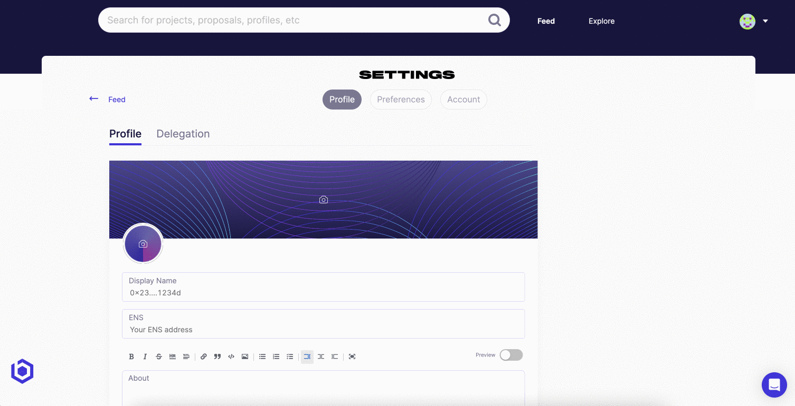

# Profile

The **team profile page** highlights your organization's **bundled** vote and proposal history, accross an unlimited number of governance wallets. You can download your entire history as a csv and share the profile on socials.

***

## Vote History

Easily browse all of your previous vote activity accross any project your team is active in, and an unlimited number of wallets. Any team member can also download this activity or share it with relevant stakeholders.

## Metadata

Add an array of contextual information to your team profile to share with interested parties.

From the profile edit page you can modify:

1. **Display Name** - Name associated with your wallet and profile
2. **ENS** - Your ETH address
3. **About** - Share a little about yourself and your history, activities, and contributions to the communities you are a part of
4. **Twitter** - Share your Twitter handle
5. **Website** - Share a link to your personal site or project

From the delegation edit page you can modify:

1. **Delegation Pitch** - Select projects and draft a pitch.
2. **Verification** - Activate a verified marker on your profile.
