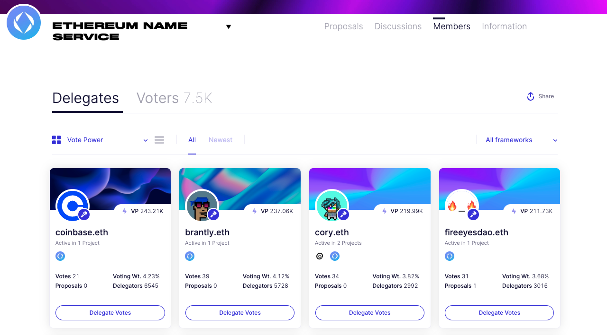

# 👥 Delegate Discovery

***

The Delegates page enables stakeholders to browse profiles of delegates and delegate their vote power. After finding a suitable delegate, tokenholders can delegate their vote from within the page by selecting the "Delegate Votes" button on a given delegates profile.

Delegate profiles contain:

1. History of their votes
2. Number of delegators
3. Voting weight
4. Proposal history

After connecting their wallet, delegates can also share additional information about themselves and their voting behavior within their profile.
