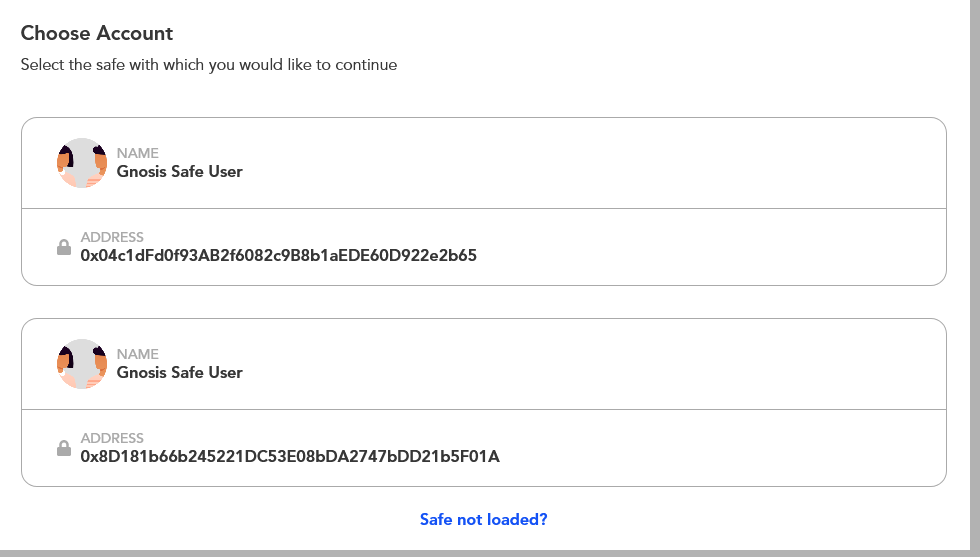
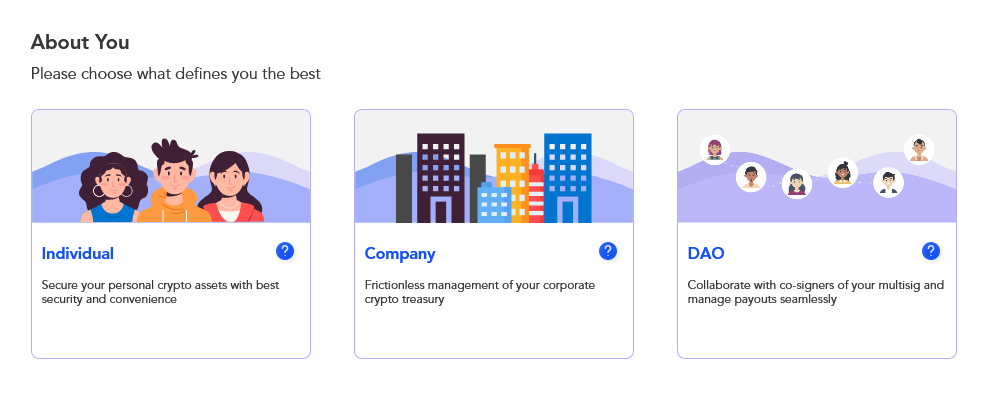

# Treasury Information

Adding your project's treasury information is an important step to fostering transparent collaboration for your community. 

Here's how to do it via our integration with MultiSafe: 

**Note: You need to have a Gnosis-safe multi-sig account.** 

Be sure to check your safe address, assets, owners, and policies such that the details match when you import them on MultiSafe. 

To import an existing account, follow the steps: 

**Step 1 -** Click on the ‘Import existing safe’ button.

**Step 2 -** Choose Gnosis safe account, such that all the transaction details are visible on MultiSafe dashboard.

**Step 3 -** Out of 3 options select any one \(Individuals, Company or DAO\) as required.

