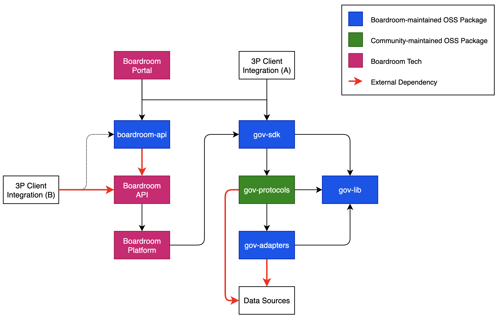

# System Architecture

## System Architecture Overview


For a higher-level and less technical oveview of how Boardroom looks, see [Boardroom Overview](../boardroom-overview.md)


## The Governance SDK

The Governance SDK is managed as an open-source TypeScript monorepo.

### gov-lib

This is the lowest level package in the SDK monorepo. It defines the core adapter types, utilities, schemas, and transports of the Governance SDK. It contains no protocol-specific code. 

See [Adapters](../sdk/adapters/) for more information on the low-level interoperability components.

### gov-adapters

This package contains all "pre-built" adapter implementations for common governance frameworks and services. This allows most [protocol integrations](../sdk/integrating-your-protocol.md) to be a matter of trivial configuration and not a custom-coded mapping implementation.

Like all adapters, these implementations use transports to directly communicate with downstream datasources.

See [Frameworks](../sdk/governance-frameworks/) for information and all current implemented frameworks.

### gov-protocols

This package contains all protocol integrations. Generally a protocol integration will import one or more pre-built framework and register adapter instances with the Governane SDK.



### gov-sdk

This is the "top level" package of the Governance SDK. It combines the implemented protocols in `gov-protocols` with some of the core functionality in `gov-lib` to create a complete governance interopability layer.

## The Boardroom API

The **Boardroom API** is an HTTP web API that can be used to query aggregated and indexed data from the **Boardroom Platform**. The platform uses the interoperability functionality of the Governance SDK to fetch and map data into a standardized format before indexing.


While we favor decentralization, the value provided by having a traditional web2 platform for aggregating and querying large volumes of data at-scale is currently worth some compromise. 

We are constantly evaluating the latest decentralized platforms and tech in the space with the goal of working towards more robust, trustless, and censor-resistant architectures.


## Client Integrations

Client integrations refer to any third-party application or experience built on top of the Governance SDK or the Boardroom API.

Client integrations can happen in the following ways:

**3P Client Integration \(B\)** shows how an third-party integration could directly access our [Boardroom HTTP API](../boardroom-api/boardroom-api.md). This is the fastest and simplest way to get access to governance data as it only requires a simple HTTP web client. 

**3P Client Integration \(A\)** shows how a third-party client could function more like the Boardroom Portal and leverage _both_ the Governance SDK \(for direct governance data from downstream datasources or submitting on-chain transactions\) and the Boardroom API \(for aggregated, highly available governance data\).

A simple and autogenerated TypeScript HTTP client package `boardroom-api` is provide as a typesafe way to interact with our HTTP API.

