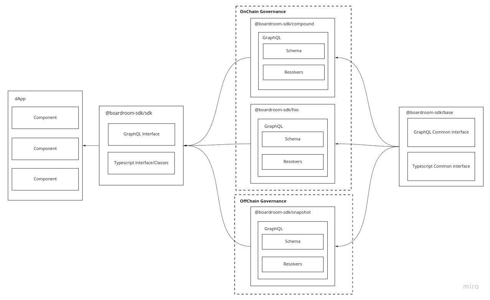

# Architecture

The Boardroom SDK's architecture consists of a base package that contains common interfaces that abstract governance protocol entities; a collection of protocol specific packages that make use of these common interfaces; and an sdk package that aggregates all protocol specific types and resolvers and that can be easily consumed by a dApp.



To achieve the aforementioned architecture, the package is organized as a monorepo. Below is a list of the Core Packages and a brief explanation of each.

#### **Core Packages**:

* Base
* CLI
* SDK

#### **Protocol Packages**:

* Compound
* Uniswap
* Yearn
* Maker
* Powerpool

The protocol packages list will grow as support for more protocols is added to the SDK.

## Core Packages

### @boardroom-sdk/sdk:

The `@boardroom-sdk/sdk` package contains all interfaces and classes to perform read and write operations on the supported governance protocols, that can be imported in an application.

These classes and interfaces allow application developers to have the following developer experience:

```typescript
import { Yearn, YearnProposal } from '@boardroom-sdk/sdk';

export const getYearnProposals: Promise<YearnProposal[]> = async () => {
  const yearn = new Yearn()
  const yearnProposals = await yearn.getProposals()

  return yearnProposals
}
```

Where `yearnProposals` is of type `YearnProposal[]`, meaning `yearn.getProposals` is typesafe.

This is the package an application developer would install from npm.

### @boardroom-sdk/base:

The most essential aspect to be noted are the common interfaces, which allows all integrated protocols to be queried in a uniform way. For example, all protocols implement the base package's Proposal interface.

### @boardroom-sdk/cli:

The Cli package contains all "global" scripts that manipulate data across the monorepo, such as schema validation, types aggregation, resolvers aggregation and code generation.

## Protocol packages

These packages should contain protocol-specific logic only. They consist of GraphQL types definitions for each entity that could be fetched \(or manipulated in future stages\) from the protocol, and resolvers to write or read data from the protocol's data sources \(smart contracts, subgraphs, APIs, Snapshot\).

If you'd like to learn more about what requirements protocol packages have, see this section below

